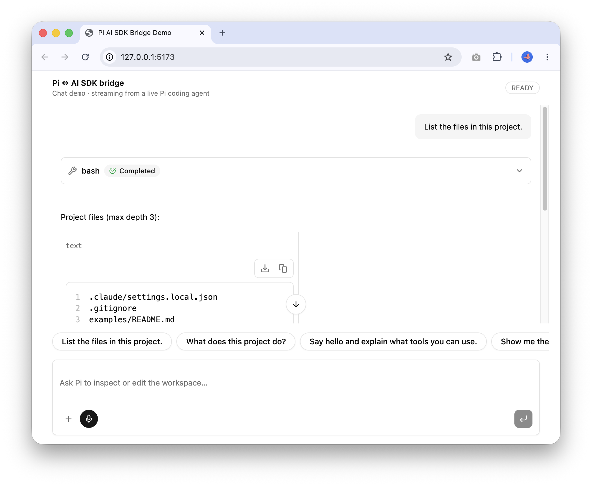

# pi-ai-sdk-bridge

Third-party bridge from [`@earendil-works/pi-coding-agent`](https://www.npmjs.com/package/@earendil-works/pi-coding-agent) `AgentSession` streams to Vercel AI SDK v6 `useChat` UI message streams.

The goal is to use rich [AI Elements](https://elements.ai-sdk.dev/) for the UI while using Pi as the agent harness.



## Quick start

```sh
pnpm install
pnpm build
pnpm bridge
```

Then run the chat demo:

```bash
cd examples/chat
pnpm dev
```

Open <http://127.0.0.1:5173>. The Vite app proxies `/api/chat` to the bridge, so no CORS setup is needed locally.

## Documentation

All project documentation beyond this core README lives in [`docs/`](docs/):

- [`docs/roadmap.md`](docs/roadmap.md) — implementation status and remaining work.
- [`docs/implementation-plan.md`](docs/implementation-plan.md) — protocol mapping and milestone plan.
- [`docs/examples.md`](docs/examples.md) — chat demo instructions.
- [`docs/package.md`](docs/package.md) — package/CLI notes and security warning.
